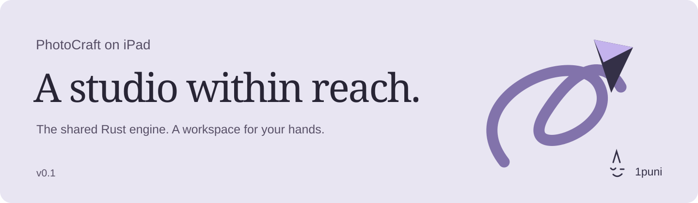
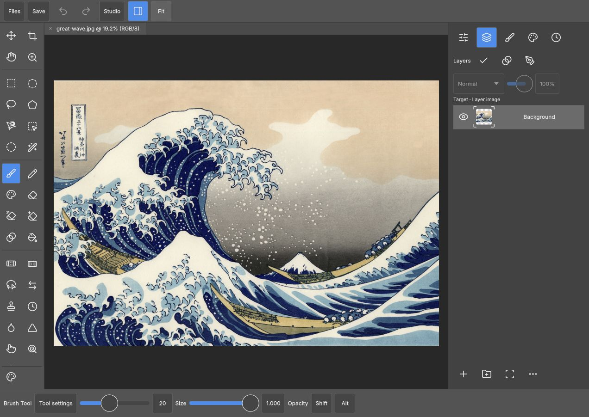
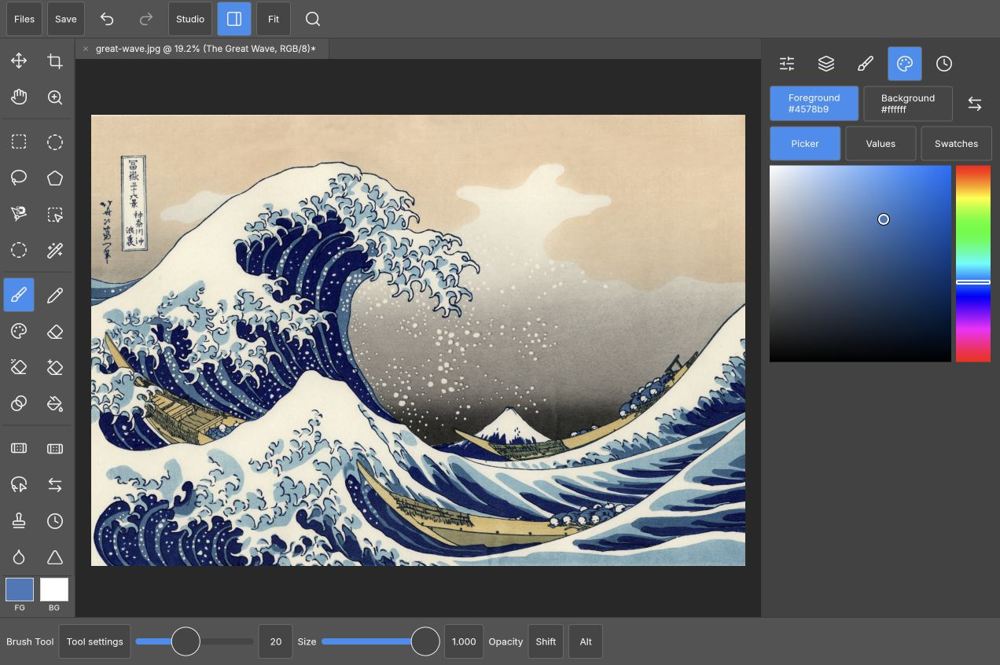
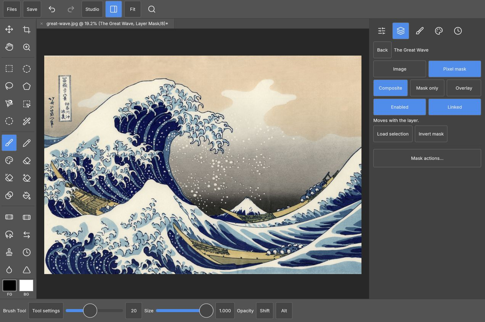

<p align="center"></p>

<p align="center"><strong>A touch workspace for PhotoCraft. Built in Rust. Made for Pencil.</strong><br>
Layers, brushes, masks, channels and paths — with room for your hands.</p>

<p align="center"><strong>v0.1</strong> · iPad browser workspace · MIT OR Apache-2.0<br>
<a href="#build-and-try-locally">Build it</a> · <a href="docs/ipad-port.md">Roadmap</a> · <a href="CONTRIBUTING.md">Contribute</a> · <a href="https://github.com/storytold/photocraft">PhotoCraft upstream</a></p>



<p align="center"><sub>The actual v0.1 browser workspace. Artwork: Hokusai, <em>The Great Wave off Kanagawa</em>, public domain.</sub></p>

## A workspace that meets your hands

**Pencil draws. Fingers navigate.** The Rust input adapter separates pen and touch,
preserves each sample's pressure and tilt, forwards coalesced samples when the
browser provides them, suppresses palm contacts during drawing, and releases
input on cancellation. Two fingers pan and pinch the canvas.

**The controls come to you.** All 49 tools live in a grouped, scrollable rail,
with contextual options and an inspector that moves below the canvas in portrait
and Split View. Browse the familiar menu hierarchy or open search from the top
bar. Search uses normal keyboard input, including the iPad keyboard's dictation;
ambiguous names offer labelled choices.

**Select, retouch, keep going.** Clone Stamp and Healing offer a one-shot
**Set source** action: choose the source, then paint. Create a layer from selected
pixels with **Layer via Copy/Cut**. Scroll panels by dragging, and keep image,
mask and vector targets distinct. New Document, Export and Layer Style have
responsive touch layouts. The [brush studio](public/images/brush-studio.jpg)
exposes all 13 shared dynamics sections and a live stroke preview.

**One editor engine.** PhotoCraft's Rust engine, canvas, file services and command
system do the editing. This crate supplies the workspace and input adapter through
a small browser-host seam. Edits follow the same command and undo paths. We link
the core; we don't maintain another copy of it.

## Colour, exactly where you want it

Pinned foreground/background chips keep both colours visible. Colour studio
combines a smooth saturation/value and hue picker with precise **RGB, HSB,
Lab D50 and hex** entry. Each target remembers its hue through black and grey;
switching numeric models preserves the chosen colour.

Save named swatches in the browser and restore them in another workspace.
Foreground changes also recolour selected type through PhotoCraft's shared
editing command, with Undo.



## Masks beside the canvas

Keep drawing while mask controls stay in the dock. Choose **Composite, Mask only
or Overlay**, toggle Enabled and Linked, load a selection, invert, or apply and
remove a mask. Vector masks expose path editing and conversion to a pixel mask.
Switching targets finishes Quick Mask while preserving the selection you edited.
Adjust **density and feather** independently for pixel and vector masks, using
44-point sliders or precise numeric entry. Feather uses a logarithmic slider
for fine control near sharp edges, and each drag is one Undo step.

Layers scroll independently above pinned actions. Nested groups and masked layers
use compact or two-line rows to keep names readable and targets easy to hit;
image and mask thumbnails stay distinct as the workspace resizes.
Switch on **Arrange** for dedicated handles that move a layer, group or selected
set above, below or into another group. Selected layers keep their relative order
and active target, with one-step Undo restoring the order and selection.
Hold the dragged handle near
the stack's top or bottom edge to scroll to offscreen layers. Ordinary row drags
still scroll the stack.

Layer properties stay in the dock too: rename, blend mode, opacity, visibility
and locks, with Back pinned above the scrolling controls. Opening properties
keeps your image or mask paint target active and leaves the canvas in reach.
Undo restores an edit's pre-edit layer selection; an opacity drag stays one
history step, and selecting a layer alone adds none.



## Built with PhotoCraft

[PhotoCraft](https://github.com/storytold/photocraft), by the ArtCraft team and
contributors, supplies the image editor underneath: its formats, rendering,
brush engine and shared controls. This independent [1puni](https://1puni.com)
project brings that foundation to a dedicated iPad workspace.

Reusable engine improvements are kept as eight reviewable patches: browser host
hooks, touch controls, batched pen fidelity, responsive dialogs, layer reveal,
multi-layer arrangement, pre-edit selection restoration on Undo, and pixel-mask
properties. Our
[upstream notes](docs/upstream.md) explain the proposed contribution path and
recognize the other mobile and browser projects working nearby.

## Build and try locally

You need Git, Rust **1.96 or newer**, the WebAssembly target, [Trunk](https://trunkrs.dev/)
and [uv](https://docs.astral.sh/uv/). Tested with Rust 1.96.0 and Trunk 0.21.14.
[cargo-about](https://github.com/EmbarkStudios/cargo-about) bundles dependency licenses.
Choose a fresh parent directory; setup creates a sibling `photocraft` checkout.

```sh
git clone https://github.com/1puni/photocraft-ipad.git
cd photocraft-ipad
rustup target add wasm32-unknown-unknown
cargo install trunk --version 0.21.14 --locked  # if not already installed
cargo install cargo-about --version 0.9.2 --locked --features cli
./setup.sh
./build.sh
uv run --no-project --python 3.12 python server.py
```

Open **http://localhost:4876** on the host, or its LAN address on an iPad on the
same network. Start in Safari. The local preview selects WebGL2; WebGPU needs
a secure origin. The launch page also includes a Pencil diagnostic pad showing
the pressure, tilt and samples the browser actually delivers.

Documents are edited in your browser. Save downloads a file to keep in Files;
save before closing or reloading, as automatic recovery is not yet available.

`setup.sh` uses the exact public upstream revision and patches recorded in this
repo. It preserves existing checkouts and refuses a mismatched source tree.
`build.sh` retains the last preview if compilation fails. Built files stay out of Git. Each checkout keeps its own `target/` directory to
prevent stale application code from another checkout being linked.

## Where v0.1 goes next

The workspace and input policies have automated coverage; browser checks include
saved swatches, mask painting, retouching, layer targeting through resizing, and
multi-layer PSD save/reopen. The next pass is measured
physical Pencil testing, longer PSD workflows, remaining touch dialogs and
recovery. The [roadmap](docs/ipad-port.md) and [test record](docs/verification.md)
keep the detail in one place.

Development happens in this repository. Build and run the workspace locally;
the roadmap tracks the next editing workflows and device checks.

## Contribute

Bring a small fix, a reproducible bug, or a drawing session's worth of feedback.
Include your device and browser versions for input reports. Start with
[CONTRIBUTING.md](CONTRIBUTING.md). Development and repository preparation use AI
assistance; source, reviewable patches and test evidence live here together.

## License and credits

MIT OR Apache-2.0, at your option: [MIT](LICENSE-MIT), [Apache-2.0](LICENSE-APACHE).
Upstream copyright and notices are preserved in [NOTICE](NOTICE).
[License review](docs/licensing.md) covers the code, assets and distribution.
[ATTRIBUTION.md](ATTRIBUTION.md) records artwork and asset sources.
PhotoCraft and ArtCraft belong to their respective authors; this is an independent
adaptation. iPad and Apple Pencil are Apple trademarks.

<p align="center"><sub>Made with PhotoCraft. A little more within reach. <a href="https://1puni.com">1puni</a> ◡</sub></p>
