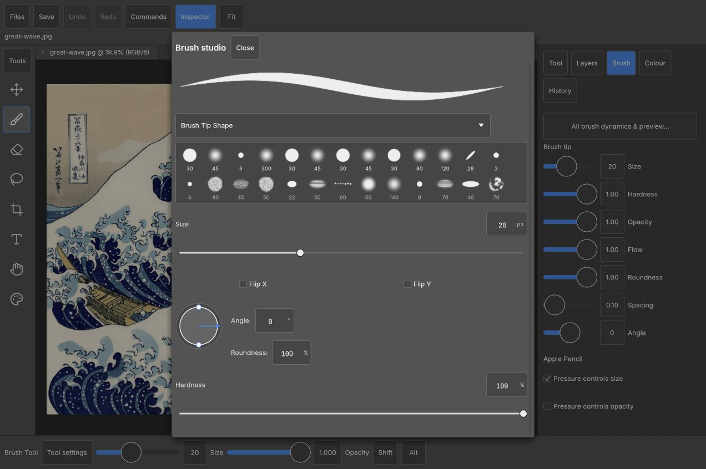

<p align="center"></p>

<p align="center"><strong>A touch workspace for PhotoCraft. Built in Rust. Made for Pencil.</strong><br>
Layers, brushes, masks, channels and paths — with room for your hands.</p>

<p align="center"><strong>v0.1</strong> · iPad browser workspace · MIT OR Apache-2.0<br>
<a href="#build-and-try-locally">Build it</a> · <a href="docs/ipad-port.md">Roadmap</a> · <a href="CONTRIBUTING.md">Contribute</a> · <a href="https://github.com/storytold/photocraft">PhotoCraft upstream</a></p>


<p align="center"><sub>The actual v0.1 browser workspace. Artwork: Hokusai, <em>The Great Wave off Kanagawa</em>, public domain.</sub></p>

## A workspace that meets your hands

**Pencil draws. Fingers navigate.** The Rust input adapter separates pen and touch,
preserves each sample's pressure and tilt, forwards coalesced samples when the
browser provides them, suppresses palm contacts during drawing, and releases
input on cancellation. Two fingers pan and pinch the canvas.

**The controls come to you.** A touch tool rail, contextual options and an
inspector that moves below the canvas in portrait and Split View. Browse the
full tool grid and command catalogue; work with layers, groups, masks, channels,
paths, colour and undo history. The brush studio exposes all 13 shared dynamics
sections and a live stroke preview. New Document, Export and Layer Style have
responsive touch layouts.

**One editor engine.** PhotoCraft's Rust engine, canvas, file services and command
system do the editing. This crate supplies the workspace and input adapter through
a small browser-host seam. Edits follow the same command and undo paths. We link
the core; we don't maintain another copy of it.

## Built with PhotoCraft



<p align="center"><sub>PhotoCraft’s brush controls, composed into a touch sheet.</sub></p>

[PhotoCraft](https://github.com/storytold/photocraft), by the ArtCraft team and
contributors, supplies the image editor underneath: its formats, rendering,
brush engine and shared controls. This independent [1puni](https://1puni.com)
project brings that foundation to a dedicated iPad workspace.

Reusable engine improvements are kept as four reviewable patches: browser host
hooks, touch controls, batched pen fidelity, and responsive dialogs. Our
[upstream notes](docs/upstream.md) explain the proposed contribution path and
recognize the other mobile and browser projects working nearby.

## Build and try locally

You need Git, Rust **1.96 or newer**, the WebAssembly target, [Trunk](https://trunkrs.dev/)
and [uv](https://docs.astral.sh/uv/). Tested with Rust 1.96.0 and Trunk 0.21.14.
Choose a fresh parent directory; setup creates a sibling `photocraft` checkout.

```sh
git clone https://github.com/1puni/photocraft-ipad.git
cd photocraft-ipad
rustup target add wasm32-unknown-unknown
cargo install trunk --version 0.21.14 --locked  # if not already installed
./setup.sh
./build.sh
uv run --no-project --python 3.12 python server.py
```

Open **http://localhost:4876** on the host, or its LAN address on an iPad on the
same network. Start in Safari. The local preview selects WebGL2; WebGPU needs
a secure origin. The launch page also includes a Pencil diagnostic pad showing
the pressure, tilt and samples the browser actually delivers.

Documents are edited in your browser. Save downloads a file to keep in Files;
save before closing or reloading, as automatic recovery is not yet available.

`setup.sh` uses the exact public upstream revision and patches recorded in this
repo. It preserves existing checkouts and refuses a mismatched source tree.
`build.sh` retains the last preview if compilation fails. Built files stay out of Git.

## Where v0.1 goes next

The workspace and input policies have automated coverage; browser checks cover
create, paint, undo/redo, layer effects and export. The next pass is measured
physical Pencil testing, longer PSD workflows, remaining touch dialogs and
recovery. The [roadmap](docs/ipad-port.md) and [test record](docs/verification.md)
keep the detail in one place.

We are preparing this repository for its public debut. A hosted try-it version
and optional tips are being considered separately; today you can build and run
the workspace yourself.

## Contribute

Bring a small fix, a reproducible bug, or a drawing session's worth of feedback.
Include your device and browser versions for input reports. Start with
[CONTRIBUTING.md](CONTRIBUTING.md). Development and repository preparation use AI
assistance; source, reviewable patches and test evidence live here together.

## License and credits

MIT OR Apache-2.0, at your option: [MIT](LICENSE-MIT), [Apache-2.0](LICENSE-APACHE).
Upstream copyright and notices are preserved in [NOTICE](NOTICE).
[ATTRIBUTION.md](ATTRIBUTION.md) records artwork and asset sources.
PhotoCraft and ArtCraft belong to their respective authors; this is an independent
adaptation. iPad and Apple Pencil are Apple trademarks.

<p align="center"><sub>Made with PhotoCraft. A little more within reach. <a href="https://1puni.com">1puni</a> ◡</sub></p>
